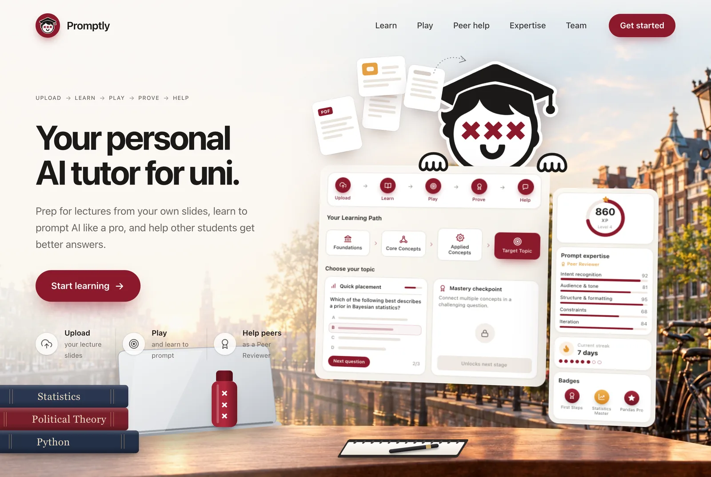
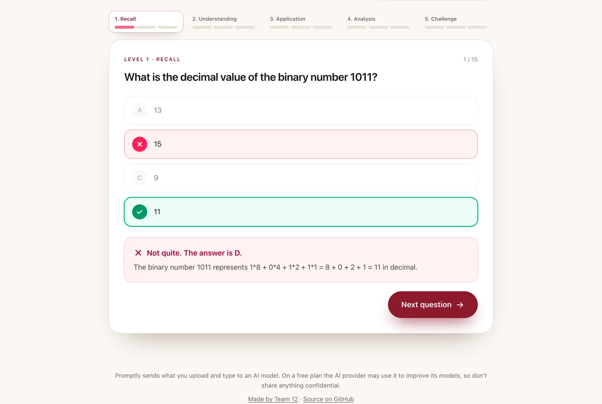
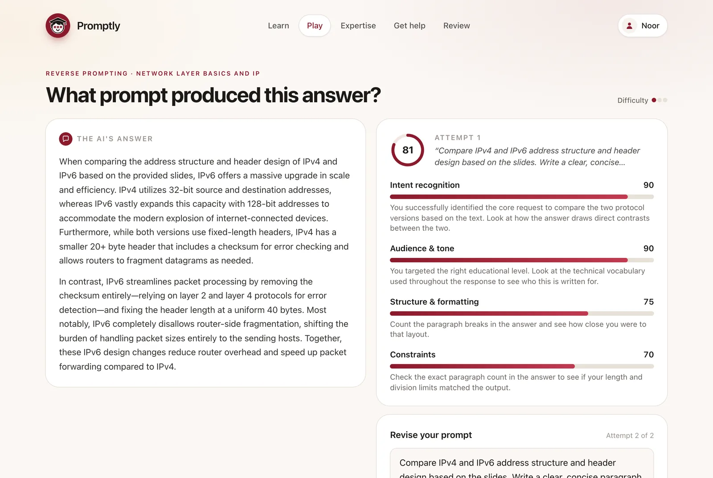
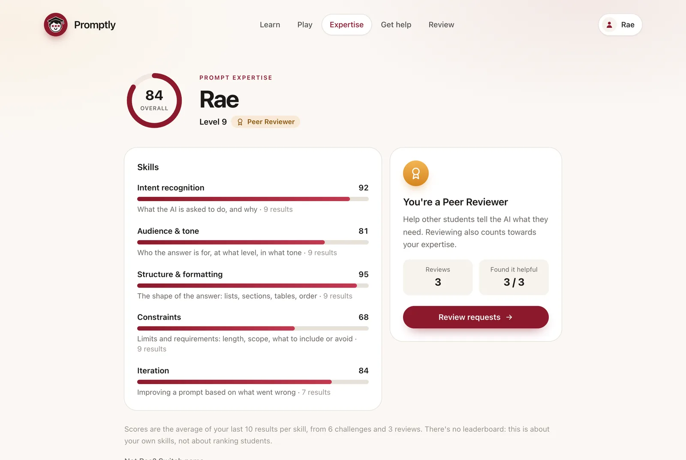
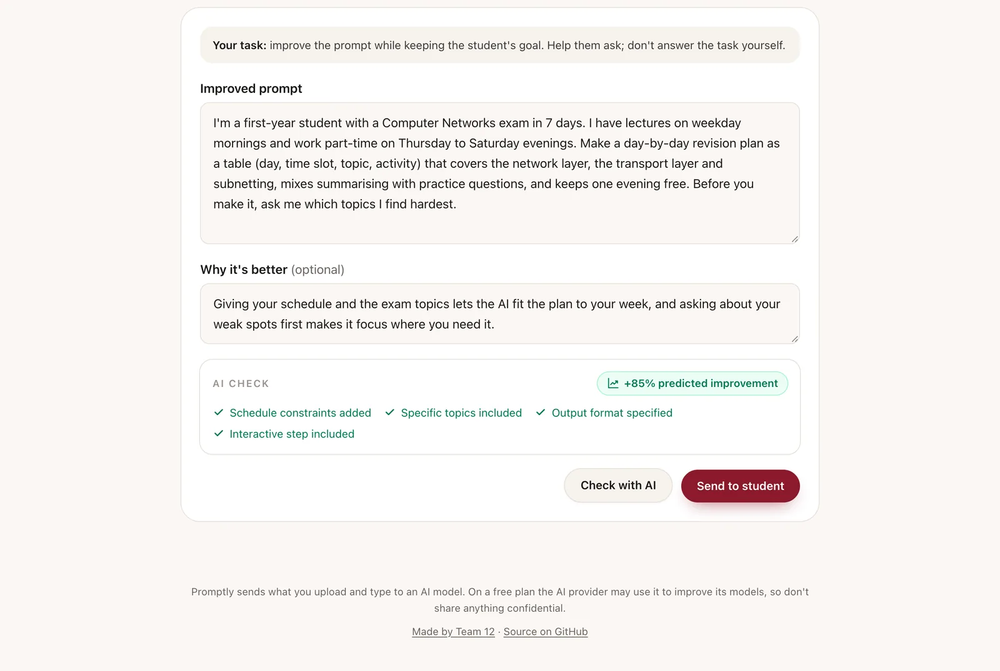
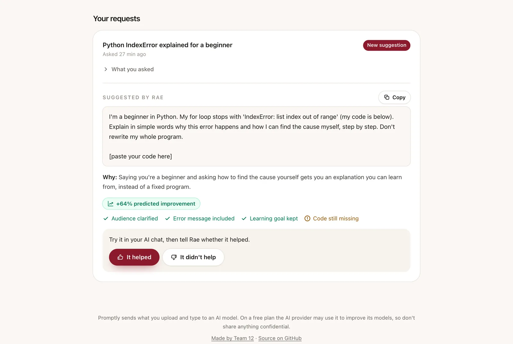
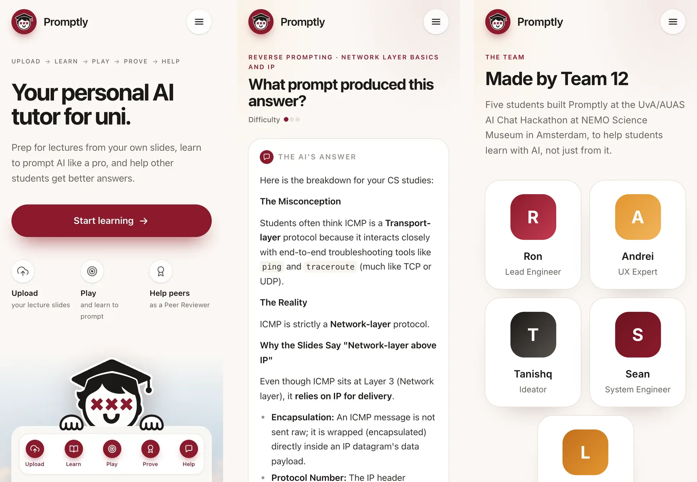

<p align="center">
  
</p>

<h1 align="center">Promptly</h1>

<p align="center">
  <b>Learn with AI, not just from it.</b><br>
  Prep for lectures from your own slides, learn to prompt AI well, and help other students get better answers.
</p>

<p align="center">
  <a href="https://promptly-sg69.onrender.com"><b>Try the live demo →</b></a>
</p>



Every student has an AI assistant now, but nobody teaches them how to use it well. Promptly
does it in four steps, all built from the slides you upload: **learn** what the lecture builds
on, **play** reverse-prompting challenges, **prove** your prompting skills, and **help** other
students as a Peer Reviewer.

> The demo runs on a free server that sleeps when nobody uses it, so the first visit can take
> about a minute. There are no accounts: you just pick a name. Try **Rae** to see the reviewer
> side straight away, or **Sam** to see a suggestion a reviewer sent.

## How it works

### 1. Learn: walk into the lecture prepared

Upload the slides of a lecture as a PDF. The AI works out which topics the lecture builds on,
you pick one, and you get a quiz on it in five levels of three questions: Recall,
Understanding, Application, Analysis and Challenge. Every answer explains why, and points
build up your rank per subject.



### 2. Play: guess the prompt behind an answer

The AI writes a prompt a student could send about your slides and shows you only its answer.
You guess the prompt. It's scored on intent, audience and tone, structure and constraints,
with hints that point at evidence in the answer without giving it away. You get one revision,
which also scores how well you acted on the hints, and then the hidden prompt is revealed.



### 3. Prove: build your prompt expertise

Each skill's score is the average of your last ten results, and they add up to a level from 1
to 10. Reach level 6 with at least five challenges and you become a Peer Reviewer. There's no
leaderboard: it's about your own skills, not ranking students.



### 4. Help: Peer Reviewers improve other students' prompts

A student who isn't getting what they want from an AI shares only their goal, their prompt
and, optionally, the answer they got. Peer Reviewers see the requests that best match their
strengths first and suggest a better prompt. Before it's sent, an AI check predicts how much
it improves the prompt, lists what it fixes and still misses, and blocks reviews that do the
student's task for them. The student tries it and says whether it helped.





It works on a phone too:



## Responsible by design

- **Privacy:** reviewers never see who asked, and requests with email addresses, phone numbers
  or student numbers are refused.
- **Academic integrity:** reviewers help students ask better; the AI check stops reviews that
  answer the assignment instead.
- **Helpfulness counts:** students rate every suggestion. Reviewers whose suggestions mostly
  don't help are paused until they've played three more challenges.
- **Your data:** what you upload and type is sent to an AI model. The live demo uses Google's
  free Gemini tier, which may use it to improve Google's products, so don't upload anything
  confidential.

## How it's built

- **Backend:** Python with [FastAPI](https://fastapi.tiangolo.com). Each feature is its own
  module in [`backend/`](backend).
- **Frontend:** React, [Vite](https://vite.dev) and [Tailwind CSS](https://tailwindcss.com),
  in [`frontend/`](frontend).
- **AI:** any OpenAI-compatible chat API. The live demo uses Google's `gemini-3.5-flash-lite`
  on the free tier. Structured answers such as quizzes and scores are requested as JSON,
  checked against a schema, and retried once if they don't fit. Each visitor gets a limited
  number of AI calls, so one person can't use up the free quota.
- **Hosting:** one Docker container on [Render](https://render.com), where FastAPI serves both
  the API and the built frontend.

It's a hackathon prototype: there are no accounts, and everything is kept in memory, so it
resets when the server restarts.

## Run it yourself

You need [uv](https://docs.astral.sh/uv/), [Node.js](https://nodejs.org) 22 and a free
Gemini API key from [Google AI Studio](https://aistudio.google.com/apikey).

```bash
git clone https://github.com/seanzlli/promptly.git
cd promptly
cp .env.example .env
```

Paste your key after `LLM_API_KEY=` in `.env`. To use Groq, OpenRouter, Ollama or another
provider instead, see the examples in [`.env.example`](.env.example).

Start the backend:

```bash
cd backend && uv run uvicorn main:app --reload
```

And in a second terminal, the frontend:

```bash
cd frontend && npm install && npm run dev
```

Open http://localhost:5173. The API docs are at http://localhost:8000/docs. Add `DEMO=1` to
`.env` to start with the example Peer Reviewer and help requests.

To run it as one container instead, the way the live demo does:

```bash
docker build -t promptly . && docker run -p 8000:8000 --env-file .env promptly
```

To deploy your own copy, choose **New → Blueprint** in Render, pick your fork, and paste your
key when it asks for `LLM_API_KEY`. [`render.yaml`](render.yaml) sets up the rest.

## The team

Promptly was built by Team 12 during an AI hackathon at the University of Amsterdam.

| | |
|---|---|
| **Ron** | Lead Engineer |
| **Andrei** | UX Expert |
| **Tanishq** | Ideator |
| **Sean** | System Engineer |
| **Lucas** | Frontend Dev |
